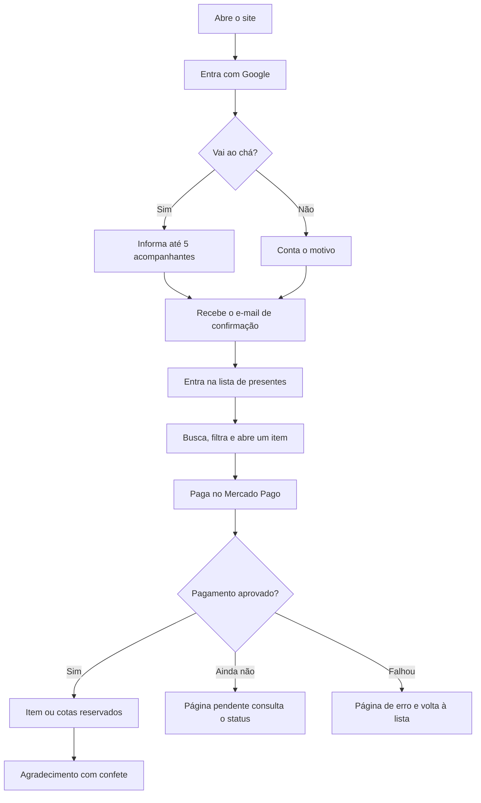
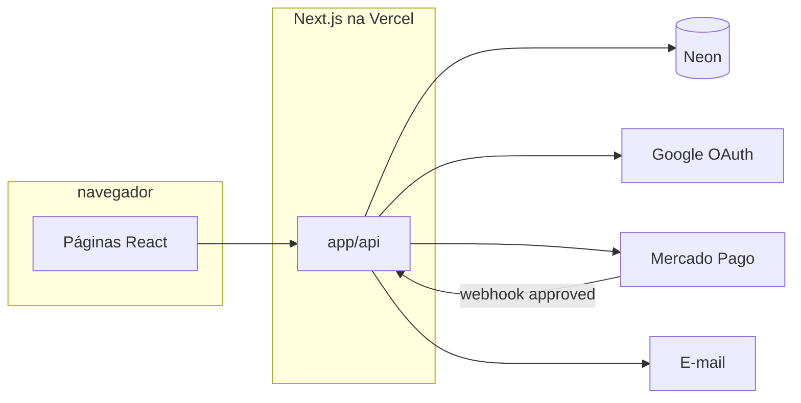

<p align="center">
  
</p>

<h1 align="center">Lista de presentes</h1>

<p align="center">
  Convite, confirmação de presença e presentes num só lugar.<br/>
  O convidado entra com o Google, responde ao chá e paga pelo Mercado Pago.<br/>
  O item só sai da lista quando o pagamento é aprovado.
</p>

<p align="center">
  
  
  
  
  
  
  
  
</p>

<p align="center">
  <a href="#o-que-o-convidado-faz">Jornada</a> ·
  <a href="#funcionalidades">Funcionalidades</a> ·
  <a href="#arquitetura">Arquitetura</a> ·
  <a href="#como-rodar">Como rodar</a> ·
  <a href="#documentação">Documentação</a>
</p>

---

## O que é

Site do **Chá de Casa Nova** de Vitória e Gerson. Substitui a lista em planilha e o PIX combinado no WhatsApp: cada convidado se identifica, diz se vai (e com quem) e escolhe um presente — inteiro ou em cotas. O Mercado Pago cobra. Um webhook reserva o estoque, uma vez por pagamento.

É um evento só. Não há painel para criar outras listas.

## O que o convidado faz



Quem já confirmou presença vê o resumo dos nomes e o botão **Presentear o casal**, sem preencher o formulário de novo.

## Funcionalidades

<table>
  <tr>
    <td width="33%" valign="top">
      <h3>🔐 Convite</h3>
      Login com Google. Na primeira visita o usuário é criado; nas seguintes, nome e foto são atualizados.
    </td>
    <td width="33%" valign="top">
      <h3>✉️ Presença</h3>
      Sim ou não. Acompanhantes só depois do sim, no máximo cinco. Ausência pede motivo. O casal recebe a resposta por e-mail.
    </td>
    <td width="33%" valign="top">
      <h3>🎁 Lista</h3>
      Catálogo com foto, categoria e preço. Busca por nome ou categoria, ordena do menor ao maior preço e esconde o que já foi reservado.
    </td>
  </tr>
  <tr>
    <td width="33%" valign="top">
      <h3>🧩 Cotas</h3>
      Presente caro pode ser dividido. Cada pagamento aprovado soma cotas. O item fecha quando a última cota é tomada.
    </td>
    <td width="33%" valign="top">
      <h3>💳 Mercado Pago</h3>
      Checkout Pro em produção ou sandbox. Retorno para sucesso, pendente ou erro. A reserva acontece no webhook, não no clique.
    </td>
    <td width="33%" valign="top">
      <h3>📋 Casal</h3>
      Página com quem confirmou, exportação para Excel e e-mail avisando um item comprado fora da loja.
    </td>
  </tr>
</table>

A lista abre com um convite em tela cheia: nomes do casal, carrossel de fotos e trilha sonora. Confetes marcam a confirmação e o presente recebido.

## Mapa do site

| Caminho | Acesso | O que acontece |
| --- | --- | --- |
| `/` | Público | Login e RSVP |
| `/lista` | Sessão obrigatória | Catálogo, filtros e modal de agradecimento (`?presenteou=true`) |
| `/presentear/[id]` | A partir da lista | Quantidade e ida ao checkout |
| `/pagamento/sucesso` | Retorno do Mercado Pago | Pagamento aceito na volta do checkout |
| `/pagamento/pendente` | Retorno do Mercado Pago | Consulta o status a cada 5 segundos |
| `/pagamento/erro` | Retorno do Mercado Pago | Falha, com volta à lista |
| `/usuarios/listar` | Uso do casal | Confirmações, Excel e e-mail |
| `/pix/[id]` | Fora do fluxo | QR estático; o pagamento real é o Checkout Pro |

## Arquitetura

Um app Next.js na Vercel. As páginas e a API moram juntas. O banco é PostgreSQL no Neon, via Prisma. Identidade é Google (NextAuth, JWT). Cobrança é Mercado Pago. E-mail sai por SMTP.



Detalhe das rotas, variáveis e riscos: [docs/architecture.md](docs/architecture.md).  
Por que não há um FastAPI ao lado: [ADR-001](docs/decisions.md).

### Como a reserva funciona

O botão de presentear **não** marca o item como reservado. Ele abre o Mercado Pago com uma referência:

```json
{ "id": "uuid-do-item", "quantidade": 1, "usuarioName": "Ana" }
```

Quando o pagamento chega `approved`, o webhook:

1. Ignora o mesmo `paymentId` se ele já estiver em `PagamentoProcessado`.
2. Se o item tem mais de uma cota, soma `cotasReservadas` até o teto.
3. Senão, diminui `quantidade` até zero.
4. Junta o nome em `reservadoPor` e grava a data.
5. Marca `reservado` quando não resta cota nem unidade.

Dois pagamentos no último item: só o que ainda cabe no estoque é aplicado. O restante fica na trilha `WebhookLog`.

## Modelo de dados

| Tabela | Papel |
| --- | --- |
| `Lista` | O evento (título, slug, moeda, datas) |
| `Item` | Presente: preço, prioridade, cotas ou quantidade, link externo |
| `Usuario` | Convidado, único por e-mail do Google |
| `Presenca` | O responsável e cada acompanhante |
| `WebhookLog` | Corpo e trilha de cada notificação |
| `PagamentoProcessado` | Trava de idempotência por `paymentId` |

Campos, invariantes e o que o JSON local **não** alimenta em produção: [docs/data-model.md](docs/data-model.md).

## Como rodar

Requisitos: Node.js 20+, npm, um banco Postgres (Neon serve) e um app OAuth no Google.

```bash
git clone <url-deste-repositório>
cd lista-presente
npm install
```

O `postinstall` gera o client do Prisma. Crie um `.env` na raiz (ele não entra no git) e suba o schema no banco vazio:

```bash
npx prisma db push
npm run dev
```

Abra [http://localhost:3000](http://localhost:3000).

| Script | Efeito |
| --- | --- |
| `npm run dev` | Next.js em desenvolvimento |
| `npm run build` | Build de produção |
| `npm run start` | Sobe o build |
| `npm run lint` | ESLint |

Não há pasta de migrations SQL versionada além do lock do Prisma. A fonte do banco é `prisma/schema.prisma`. `db push` espelha esse arquivo num banco novo; um fluxo com migrations fica para uma fatia futura.

### Variáveis

Nenhum valor vai neste repositório. Nomes esperados:

| Variável | Uso |
| --- | --- |
| `DATABASE_URL` | Connection string do Neon |
| `GOOGLE_CLIENT_ID` | OAuth |
| `GOOGLE_CLIENT_SECRET` | OAuth |
| `NEXTAUTH_SECRET` | Assinatura do JWT |
| `NEXTAUTH_URL` | URL pública do app (NextAuth em produção) |
| `AMBIENTE` | `prod` usa Mercado Pago de produção; outro valor usa sandbox |
| `MERCADO_PAGO_ACCESS_TOKEN_PROD` | Token de produção |
| `MERCADO_PAGO_ACCESS_TOKEN_TESTE` | Token de teste |
| `NEXT_PUBLIC_BASE_URL` | Origem da `notification_url` do webhook |
| `NEXT_PUBLIC_WEBHOOK_URL` | Origem das páginas de retorno |
| `SMTP_HOST` `SMTP_PORT` `SMTP_USER` `SMTP_PASS` | Envio dos e-mails |

No Google Cloud, a origem de redirect do NextAuth precisa incluir `/api/auth/callback/google`. No Mercado Pago, a URL de notificação precisa alcançar `/api/mercado-pago-webhook` numa origem pública (em local, um túnel).

O identificador da lista do evento está fixo nos componentes da lista e do detalhe. O banco precisa ter essa `Lista` e os `Item` ligados a ela. Trocar isso para ambiente ou slug é a dívida [F-102](docs/backlog.md).

## Pastas

```text
app/
  page.tsx                 convite e RSVP
  lista/                   catálogo
  presentear/[id]/         detalhe e checkout
  pagamento/               sucesso, pendente, erro
  usuarios/listar/         painel do casal
  api/                     usuários, presença, itens, pagar, webhook, e-mail
  components/              cards, filtros, header, confetes, player
  lib/                     Prisma e NextAuth
prisma/schema.prisma       modelo
public/                    fotos, áudio, ícones
docs/                      produto, arquitetura, contratos
```

## Documentação

| Documento | Conteúdo |
| --- | --- |
| [docs/product.md](docs/product.md) | Problema, público, escopo e métrica |
| [docs/architecture.md](docs/architecture.md) | Limites, fluxos, stack, ambiente, riscos |
| [docs/decisions.md](docs/decisions.md) | ADRs (monólito, Neon, reserva no webhook, Checkout Pro) |
| [docs/contracts.md](docs/contracts.md) | Contrato de cada rota |
| [docs/data-model.md](docs/data-model.md) | Tabelas e invariantes |
| [docs/backlog.md](docs/backlog.md) | O que já foi entregue e a dívida |
| [docs/definition-of-done.md](docs/definition-of-done.md) | Pronto de uma fatia nova |
| [AGENTS.md](AGENTS.md) | Como um agente deve ler este repositório |

## Limites atuais

- Um casal, uma lista, login só com Google.
- Várias rotas de API ainda não exigem sessão (lista geral de convidados, criação de item, envio de e-mail). O painel `/usuarios/listar` também não passa pelo middleware. Está registrado como [F-101](docs/backlog.md).
- A consulta de status na página pendente usa o token de teste, e o texto da tela não acompanha o `status` da API ([F-104](docs/backlog.md)).
- Não há suíte de testes automatizados ([F-103](docs/backlog.md)).
- O arquivo `app/data/itens.json` é referência de formato. A vitrine lê o banco.

## Licença

MIT. Copyright (c) 2026 Gerson Vieira Pedro. Texto completo em [LICENSE](LICENSE).
