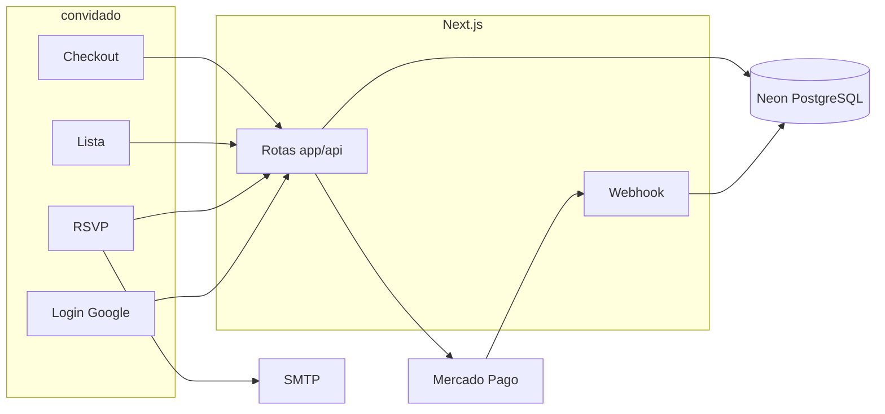

# Architecture

Status: vigente

## Contexto

Site do Chá de Casa Nova de Vitória e Gerson. O convidado entra com Google, confirma presença e presenteia pela lista. O Mercado Pago cobra; o webhook reserva o item no PostgreSQL (Neon). O casal consulta confirmações em uma página interna.

Tudo roda num único app Next.js. Não há serviço de API separado.

## Limites

- Frontend e API (`app/`): páginas do convite, lista, checkout e rotas `app/api/*`.
- Banco: PostgreSQL no Neon, acessado pelo Prisma com adapter serverless.
- Provedores externos:
  - Google (NextAuth) — identidade do convidado
  - Mercado Pago — preferência de pagamento e consulta de pagamento
  - SMTP (Nodemailer) — e-mails do casal
  - Vercel Analytics e Speed Insights

## Fluxos principais

### Confirmar presença

1. Convidado abre `/` e entra com Google.
2. O cliente cria ou atualiza o usuário em `POST /api/usuarios`.
3. Responde sim (com acompanhantes) ou não (com motivo).
4. `POST /api/presenca` grava a presença e marca `confirmouPresenca`.
5. `POST /api/enviar-email` manda o HTML de confirmação.
6. O link leva a `/lista`.

### Presentear

1. Middleware exige sessão em `/lista`.
2. A página busca `GET /api/itens?listaId=…`.
3. O convidado abre `/presentear/[id]`, escolhe a quantidade e chama `POST /api/pagar`.
4. A API cria uma preferência no Mercado Pago e devolve `init_point` (produção ou sandbox).
5. O Mercado Pago redireciona para `/pagamento/sucesso`, `/pagamento/pendente` ou `/pagamento/erro`.
6. O webhook `POST /api/mercado-pago-webhook` busca o pagamento, e só então reserva cotas ou baixa a quantidade.

A reserva **não** acontece no clique. Ela acontece quando o pagamento chega como `approved`.

## Stack

| Camada | Escolha | Notas |
| --- | --- | --- |
| App | Next.js 16, React 19, TypeScript, Tailwind CSS 4 | App Router; sem shadcn/ui |
| API | Route Handlers em `app/api` | Desvio do FastAPI — [ADR-001](decisions.md) |
| Banco | PostgreSQL (Neon) + Prisma 7 | Adapter `@prisma/adapter-neon` |
| Auth | NextAuth 4, Google, sessão JWT | Middleware só em `/lista` |
| Pagamento | Mercado Pago Checkout Pro | Token de teste ou produção via `AMBIENTE` |
| E-mail | Nodemailer | Remetente “Vitória & Gerson” |
| Deploy | Vercel | Analytics e Speed Insights no layout |

## Rotas de página

| Caminho | Quem usa | Função |
| --- | --- | --- |
| `/` | Convidado | Login e confirmação de presença |
| `/lista` | Convidado autenticado | Catálogo, filtros, modal de agradecimento |
| `/presentear/[id]` | Convidado | Detalhe e início do pagamento |
| `/pagamento/sucesso` | Convidado | Retorno aprovado |
| `/pagamento/pendente` | Convidado | Consulta o status a cada 5s |
| `/pagamento/erro` | Convidado | Retorno de falha |
| `/pix/[id]` | — | Tela de PIX com payload estático; o fluxo real é o Checkout Pro |
| `/usuarios/listar` | Casal | Confirmações, Excel e e-mail de reserva |

## Variáveis de ambiente (nomes, sem valores)

- `DATABASE_URL` — connection string do Neon
- `GOOGLE_CLIENT_ID`
- `GOOGLE_CLIENT_SECRET`
- `NEXTAUTH_SECRET`
- `NEXTAUTH_URL` — exigida pelo NextAuth em produção
- `AMBIENTE` — `prod` usa token e `init_point` de produção; qualquer outro valor usa sandbox
- `MERCADO_PAGO_ACCESS_TOKEN_PROD`
- `MERCADO_PAGO_ACCESS_TOKEN_TESTE`
- `NEXT_PUBLIC_BASE_URL` — origem pública usada em `notification_url`
- `NEXT_PUBLIC_WEBHOOK_URL` — origem das `back_urls` de retorno
- `SMTP_HOST`
- `SMTP_PORT`
- `SMTP_USER`
- `SMTP_PASS`

Arquivos `.env*` estão no `.gitignore`.

## O que não construir agora

- Microserviços, filas e um segundo backend.
- Multi-tenant (vários casais).
- Painel para cadastrar itens pela interface (hoje o catálogo entra pelo banco; `POST /api/itens` existe, mas não há tela).
- Substituir o Checkout Pro por PIX interno. A página `/pix/[id]` não liquida pagamento.

## Observabilidade mínima

- `console.error` nas rotas de API.
- Tabela `WebhookLog` com corpo do webhook, recurso consultado e lista de logs.
- Tabela `PagamentoProcessado` para não aplicar o mesmo `paymentId` duas vezes.
- Vercel Analytics e Speed Insights no layout.

## Riscos conhecidos

Registrar aqui para a próxima fatia de segurança. Não são instruções de correção neste documento.

- Várias rotas de API não checam sessão: listagem geral de usuários, criação de item, envio de e-mail, leitura de usuário por e-mail na query.
- `/usuarios/listar` não passa pelo middleware (o matcher cobre só `/lista`).
- O webhook não valida assinatura do Mercado Pago antes de processar.
- `GET /api/mercado-pago-status` usa sempre o token de teste.
- A sessão do NextAuth é copiada para um cookie legível no cliente (`js-cookie`).
- Na subida, `app/lib/prisma.ts` escreve no log o host extraído de `DATABASE_URL`.
- O `listaId` da lista do evento está fixo nos componentes da lista e do detalhe.
